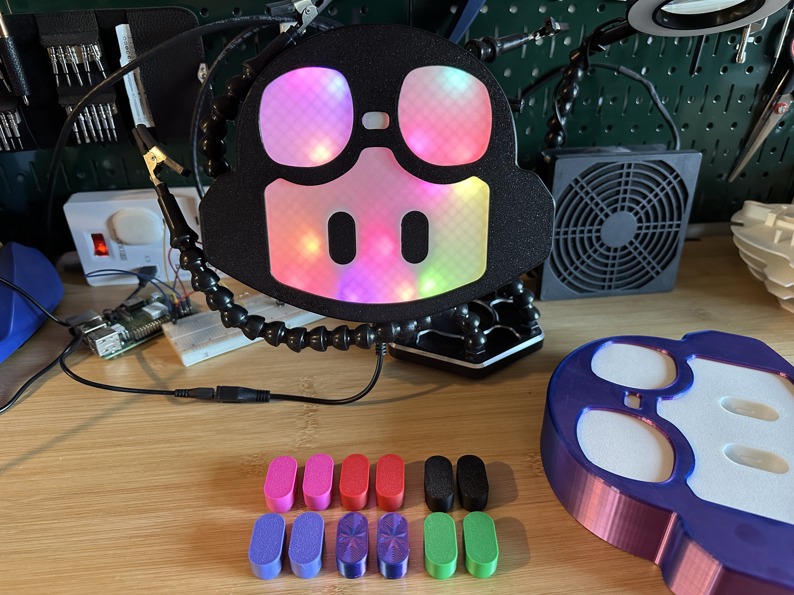
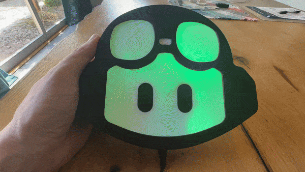
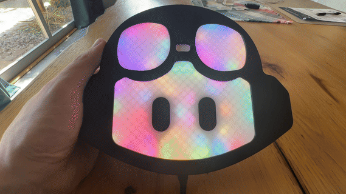
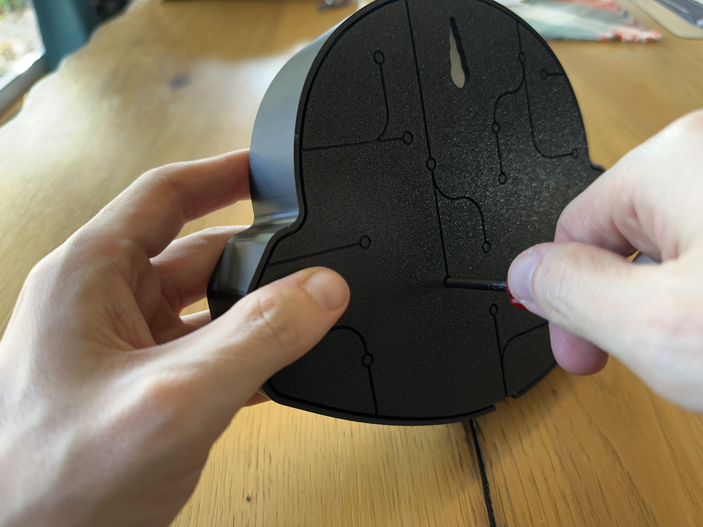
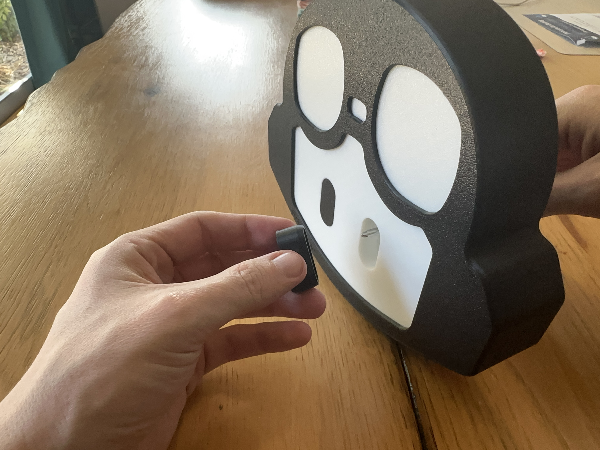
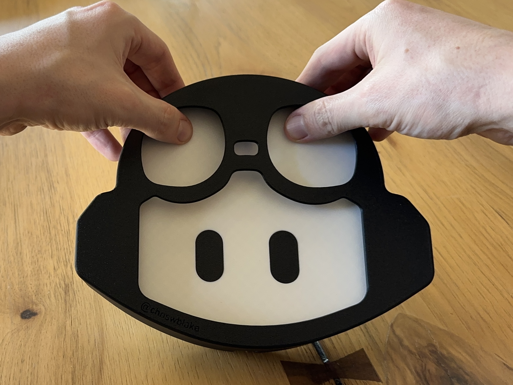

# GitHub Copilot Lamp
A fun and playful lamp to match the energy of [GitHub Copilot](https://github.com/features/copilot). It's 3d printable, fairly easy to assemble, WiFi connected and powered by [WLED](https://kno.wled.ge/) and touch!

> This project was inspired by the original [Octolamp](https://github.com/martinwoodward/octolamp). Go check it out!

## How to Use
If you received your lamp prebuilt, is has already been configured and is ready to use. Simply plug it in with a USB cable and power brick with at least 1 amp. The lamp will turn on with an "aurura" like green effect.

### How to Turn on/off
The white spot between the goggles is a touch sensor and provides basic control the lamp. For more advanced control, you can use the WLED app or web interface!

- Automatically turns on at 9am CST.
- Automatically turns off at 5pm CST.

| Single Press | Double Press | Long Press |
| - | - | - |
| Slow Fade Green | Fast Random Rainbow | Off |
|  |  |  |

### Connect to WiFi
Want full control over your lamp? Connect it to your WiFi network! (2.4ghz only)
If not connected to an existing wifi, it will broadcast a tempory wifi network for setup.

1. On your computer or phone, search for the wifi network `copilot-lamp` and connect to it.
    - Default password is `copilot-lamp`.
1. In a web browser, navigate to `http://copilot-lamp.local` or use the WLED app.
    - [iOS App](https://apps.apple.com/us/app/wled/id1475695033)
    - [Android App](https://play.google.com/store/apps/details?id=com.aircoookie.WLED)
1. Click on the settings icon.
1. Navigate to the wifi area.
1. Enter you home wifi credentials and click save. Wait a moment for the lamp to restart.
1. Reconnect your computer or phone to your home wifi.
1. In a web browser, navigate to `http://copilot-lamp.local` or use the WLED app.
    - [iOS App](https://apps.apple.com/us/app/wled/id1475695033)
    - [Android App](https://play.google.com/store/apps/details?id=com.aircoookie.WLED)

### Change eye color

1. Using a screwdriver, insert the end through the holes in the back of the lamp.  
    

1. Continue to push and the eye insert will pop forward.  
    

1. Insert the other colored eyes!

### Change helmet color (faceplate)

1. Grip the top of the mask and gently push into the white space of the goggles. You will feel the connectors pop out.  
    

1. Flip the lamp over, and repeat on the other side. Once disconnected, slide the faceplate off.

1. Apply the new faceplate!

# Build your own
That's cool and all, but how do I make one?!  
Check out the [build your own](docs/build-your-own.md) page for a step-by-step guide. 🧑‍🚀
