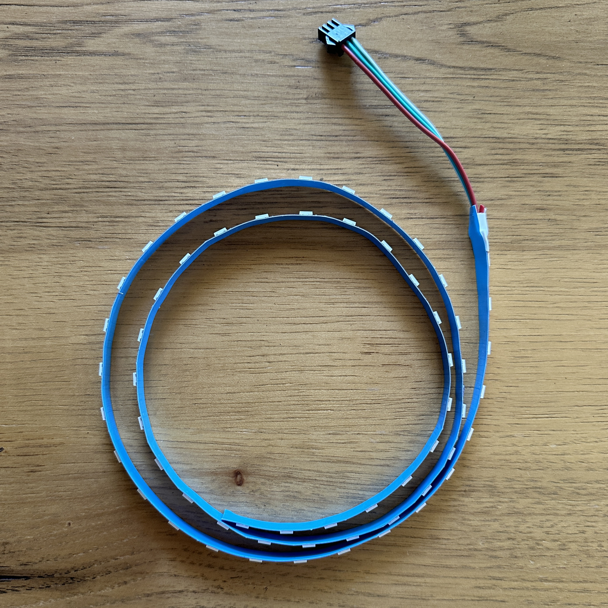
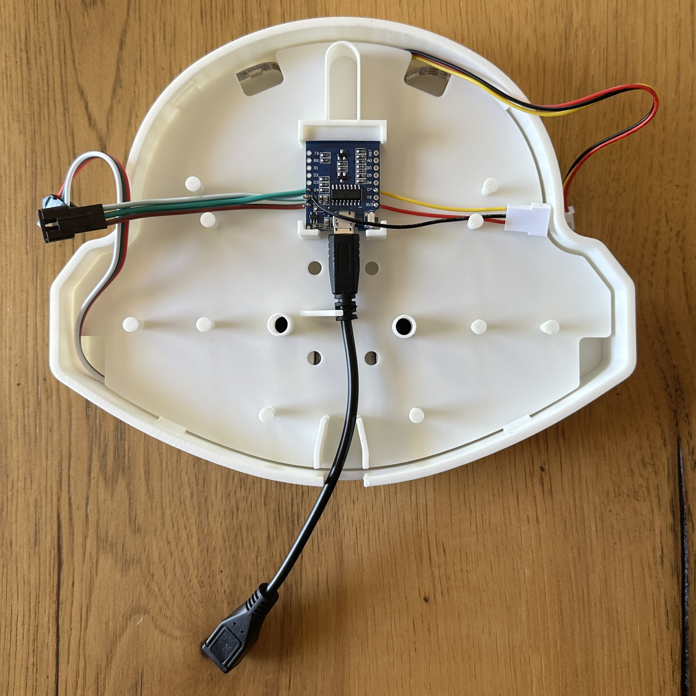
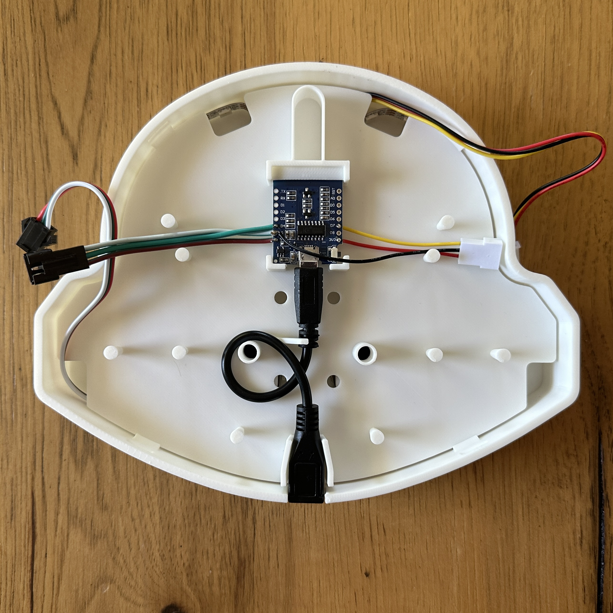
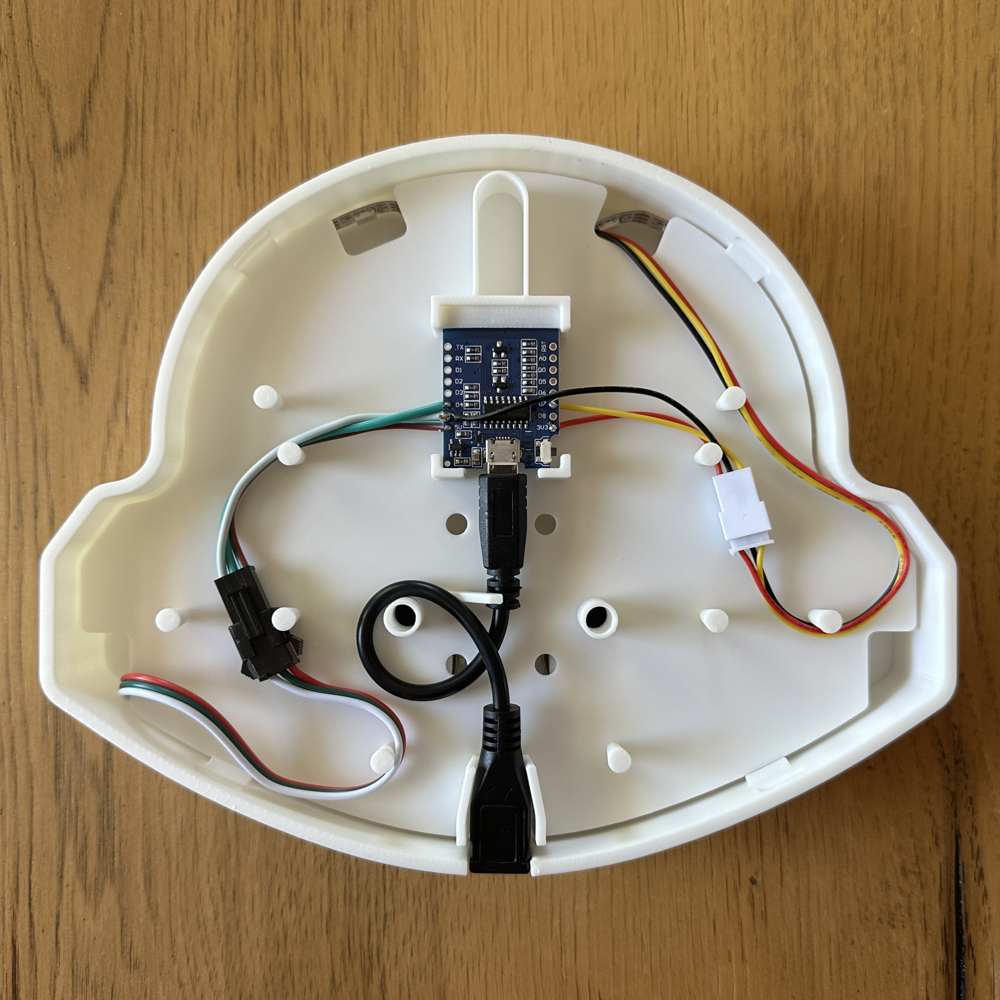

# Guide: Build Your Own 
The copilot lamp is fairly easy to assemble with a bit of soldering. The hardest part is patiently waiting for all the parts to print! 😉

In short, it is a few 3D printed parts, a microcontroller, some LEDs and a few wires to connect it all together.

## Prep Work and Sourcing Parts

### Materials
- Black PLA Filament [[US]](https://us.store.bambulab.com/products/pla-basic-filament?variant=41078274654344)
- White PLA Filament [[US]](https://us.store.bambulab.com/products/pla-basic-filament?variant=41078274687112)
- 60 LEDs (1 meter) - WS2812B Addressable LED Light Strip [[US]](https://www.amazon.com/dp/B097379J1V)
- ESP8266 Microcontroller micro-USB + WiFi [[US]](https://www.amazon.com/dp/B081PX9YFV)
- TTP223 Capacitive Touch Sensor [[US]](https://www.amazon.com/dp/B01D1D0FLG)
- JST Cable (white, 26awg) [[US]](https://www.amazon.com/dp/B0CF2BTYSK)
- Short Micro-USB Extension [[US]](https://www.amazon.com/dp/B0791ZZ3HG)
- (optional) 3/8" Shrink Tubing [[US]](https://www.amazon.com/dp/B07FK17W6B)
- (optional) JST Cable (black, 20awg) [[US]](https://www.amazon.com/dp/B071H5XCN5)
- (optional) Long micro-USB cable. [[US]](https://www.amazon.com/dp/B0CGDPS336)
<!-- - JST Socket [[US]](https://www.amazon.com/dp/B0BMDZR7RZ) -->

### Tools
- Soldering Iron
- 3D Printer

> [!NOTE]
> **Tip:** Don't have a 3D printer? Check if your local library has a makerspace. They might be able to print the parts for you! 🤩

# Instructions
The lamp is designed to be assembled by hand, minus the small amount of soldering. It's printed with regular PLA filament on a printer with at least 200x200mm print area.

## 1. Print the parts
The .STL files for all of the printable parts are in the `/models` folder.

- No supports are required.
- Avoid sparse infill for the backplate to strengthen the connectors.
- Avoid sparse infill for the LED chamber if you don't want to see a pattern through the glowing.
- For a textured look, consider a textured plate. [[US]](https://us.store.bambulab.com/products/bambu-dual-sided-textured-pei-plate)

> [!NOTE]  
> The backplate, faceplate, and eyes don't have to be black.
> Try printing them in another color or with fun multicolor or shiny filament! 🦄 🤩

| Image | Part | Description |
| -- | -- | -- |
 | LED Chamber | The part that glows, where the LEDs are attached. |
 | Electronics Plate | Sits inside the LED chamber for the microcontroller and cable management. |
 | Backplate | The back cover of the LED chamber. |
 | Faceplate* | The outer shell for changing color. |
 | Eyes | Interchange eye inserts for the face of the LED chamber. |

> [!NOTE]  
> If you know how to use Autodesk Fusion, you can add your GitHub handle to the chin of the faceplate. The 3D model already has a feature. Just change the text. 🤯

## 1. Install Software
If you order the microcontrollers from the provided link, there
is a good chance that 1 of the 5 boards will be bad.
It's important to start with installing the software.

1. Connect the microcontroller to your computer using a USB cable.
1. Open a web browser and navigate to the [WLED install page](https://install.wled.me/).
1. In the drop down, ensure version `0.15` is selected.
1. Click the **Install** button and a window will appear.
Select the USB serial device.
1. Follow the instructions and wait a few minutes for the install.
    - If this seems to have trouble, try a different board.
1. When asked, enter your WiFi details.
    - Accessing the device locally is required to upload the configuration.
1. When the install is finished, click the **Visit Device** button.
1. On the device's main page, in the top right, click the **Config** button.
1. At the bottom, select **Security and Updates**
1. Scroll to the bottom and look for the backup options.
1. Install the presets using the [`/wled-config/wled_presets_playlists.json`](../wled-config/wled_presets_playlists.json) file.  
This will do the following:
    - Install playlist 1 - Slow effects. (Single press action)
    - Install playlist 2 - Fast random effects. (Double press action)
    - Install preset 3 - LEDs off (Hold 2 seconds action)
1. Install the device configuration using the [`/wled-config/wled_config_60_led_with_touch.json`](../wled-config/wled_config_60_led_with_touch.json) file.  
This will do the following:
    - Set the device to use 60 LEDs and max 1 amp power.
    - Configure use of the touch sensor.
    - Assign the touch sensor to the playlists.
    - Configure a timer option to turn on the lamp at 9am and off at 5pm.
    - Set it to broadcast a WiFi network named `copilot-lamp`, if no WiFi is found.
    
## 2. Pre-Assembly and Testing

### LED Strip
1. Keeping the plug end, cut the 5 meter LED strip to 60 LEDs (1 meter).

> [!WARNING]  
> The ~1 meter length is more important than the 60 LEDS.
> If the strip is too long it may not fit. If it is too short, then parts may not glow. 😕

### Touch Sensor
1. Attach a JST lead cable (plug side) to the contacts of the touch sensor.
    - Black Wire: GND (ground)
    - Yellow Wire: I/O (communication)
    - Red Wire: VCC (3.3v power)

    
    

### LED Lead Cable
1. Your LED strip may have come with a simple controller. Remove the socket end from it or from the 5 meter LED strip.

    
    or
    

### Touch Lead Cable
1. Shorten a JST lead cable (socket side). Leave the black wire longer, about the width of the microcontroller.
    

### Microcontroller
1. Attach the LED lead cable (socket side) to the microcontroller.
Make sure the cables come out of the side with the wifi module.
    - Red Wire: 5V (power)
    - White Wire: G (ground)
    - Green Wire: D4 (digital)

    
    

1. Attach the Touch Sensor lead cable (socket side) to the microcontroller.
Make sure the cables come out of the side with the wifi module.
    - Red Wire: 3V3 (power)
    - White Wire: G (ground) - Note, it is on the other side.
    - Green Wire: D7 (digital)

    
    
    

2. Attach the short micro-usb extension.
    
    

### Pre-check Testing
1. Connect the LED strip and touch sensor to the microcontroller.
1. Plug in the USB cable to apply power.
1. The LEDs should randomly fade shades of green.

> [!NOTE]
> You must connect the touch sensor. If not, it will believe the touch sensor
is being held down and continuously attempt to turn of the LEDs.

## 3. Main Assembly

### LED Install
1. Starting in the bottom left, remove part of the adhesive tape on the LED
strip and attach to the support wall. Run the lead wire into the ear. Continue
attaching the the LED to the wall similar to the image below.

1. Insert the touch sensor in the rectangular slot in the forehead area.
Ensuring the touch pad is facing outward. Route the cables between the up between the guides
and to the right.

### Microcontroller Install
1. Insert the electronics plate.

1. Insert the microcontroller into the holder.
Ensure the WiFi module is facing down (toward the face).
Pinch the USB cable under the angled guide bar to secure the microcontroller.

1. Twist the USB cable around some of the left cable guides and pinch it into the holder.

> [!NOTE]  
> You might consider adding a bit of glue behind the usb extension's socket
> to prevent the cable being pulled out. The holes are backup for zip ties
> to hold the USB cable down.

1. Connect the LED cable and touch sensor cables to the microcontroller.

### Cover Plates Install
1. Attach in the backplate by gently pressing it into the LED chamber.

> [!WARNING]  
> Don't apply too much force on the tabs.
> Depending on the filament's brittleness, they might break.

1. Flip the current assembly over.

1. Attach the faceplate by gently sliding it down over the LED chamber.

1. Insert the eyes into the face of the LED chamber.

1. You are finished! See the main [README](../README.md) for usage info. Plug it in and enjoy!

## Other Advanced Tasks

### Add your GitHub Handle
If you would like to add your GitHub username, there is already a feature
in the 3d model [`/models/github-copilot-lamp.f3d`](../models/github-copilot-lamp.f3d).
Open it using [Autodesk Fusion](https://www.autodesk.com/products/fusion-360/personal), change the text, and export the STL.

### Switch to USB-C.
- ESP8266 Microcontroller USB-C + WiFi [[US]](https://www.amazon.com/dp/B0BHW1CNCM)
- Short USB-C Extension [[US]](https://www.amazon.com/dp/B01D8FMPP6)

## Troubleshooting

### Reset Device 
- Reset wifi: hold button 0 for >6 seconds.
- Reset WLED: hold button 0 for >12 seconds.

# Reference

## Manually Configure
These are the settings for manually configuring a device the same
as the premade configuration file.

### LED Preferences
- Maximum current: 850mA
- WS281x
- GPIO 2
- Turn LEDs on after power up/reset: unchecked
- Button 0 CPIO: 15 - Push Inverted
- Button 1 CPI: unused - Disabled

### WiFi Setup
DNS address: copilot-lamp.local
AP SSID: copilot-lamp
AP Pass: copilot-lamp
Disable WiFi Sleep: checked

### Time and Macros
Macro Presets Button Actions
- Button 0: short: 0, long: 0, double: 0
- Button 1: short: 1, long: 3, double: 2

### Guides, Manuals, and Tech Specs
- D1 Mini Microcontroller [Pin Detail and Guide](https://diyi0t.com/esp8266-wemos-d1-mini-tutorial)
- D1 Mini [Schematic](ref/D1%20Mini%20schematic.pdf)
- TTP223 Touch Sensor [Video Guide](https://www.youtube.com/watch?v=i0iL5MLXSdU)
- TTP223 Touch Sensor [Tech Specs](ref/D1%20Mini%20schematic.pdf)
