# Guide: Gift a friend 💚
The copilot lamp is meant to be shared, and... who doesn't want an awesome unboxing experience. 🥰

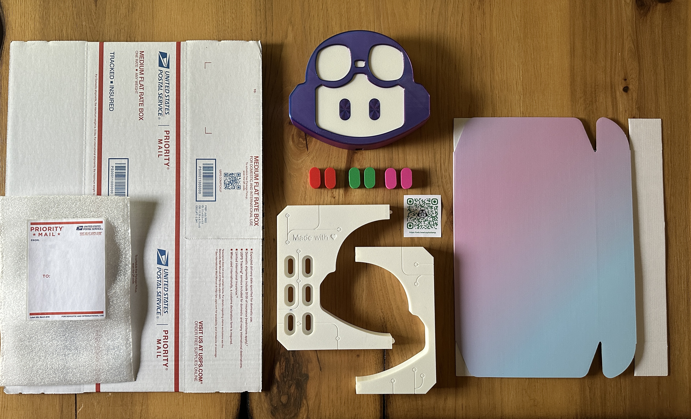

### Materials
- White PLA Filament [[US]](https://us.store.bambulab.com/products/pla-basic-filament?variant=41078274687112)
- Beautiful Gradient Purple Box (11x8x2) [[US]](https://www.amazon.com/dp/B0B7JB5KC9)
- USPS Medium Size Shipping Box, Top Loading [[US]](https://store.usps.com/store/product/shipping-supplies/priority-mail-flat-rate-medium-box-1-P_O_FRB1)
- Packing materials

# Instructions

## 1. Print the parts
The .STL files for all of the printable shipping protector are in the `/models` folder.

- No supports are required.
- Any infill is fine. No special settings are required.
- For a matte look, consider a textured plate. [[US]](https://us.store.bambulab.com/products/bambu-dual-sided-textured-pei-plate)

| Image | Part | Description |
| -- | -- | -- |
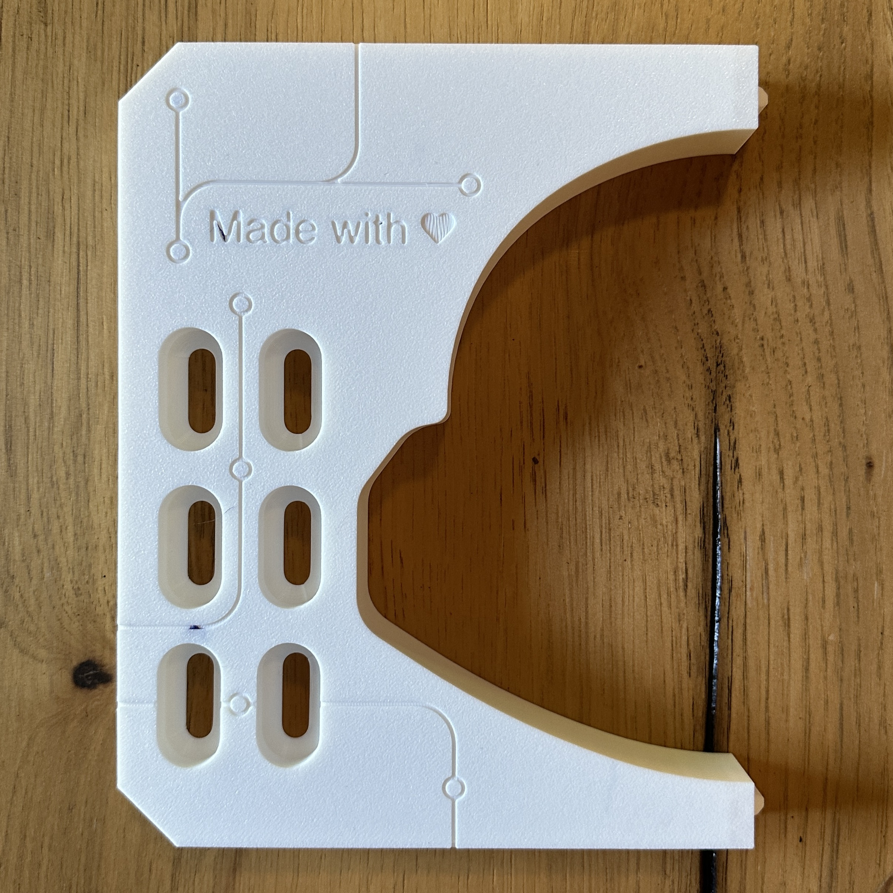 | Shipping Protector (left) | Connects with the right piece to hold the position of the lamp in the box. Has slots for holding additional eye colors. Also indirectly teaches owner how to swap eyes colors. |
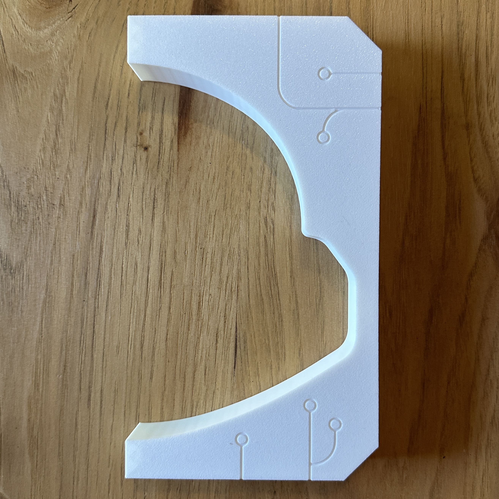 | Shipping Protector (right) | Connects with the left piece to hold the position of the lamp in the box. |
 | User Instructions QR Code | When scanned, directs user to main README for basic usage instructions. Obviously just normal 2D printing. 😉 |

## 2.  Prep the Copilot Lamp box

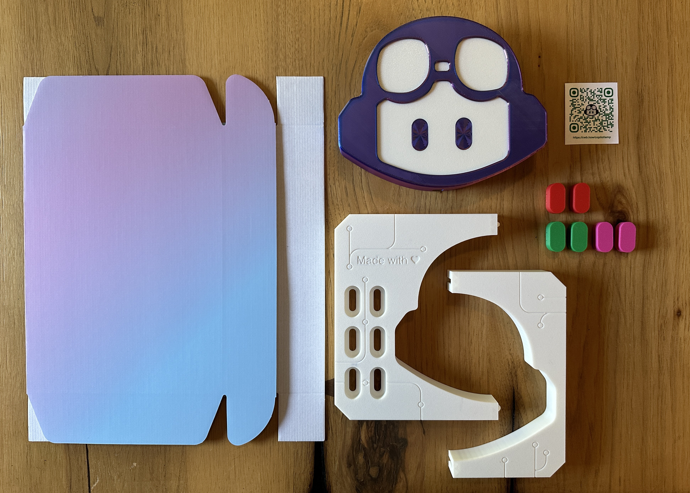

1. Ensure the tabs of the front and back are inward and fold the sides down. The side's have tabs that slip into the slot to keep the shape.
    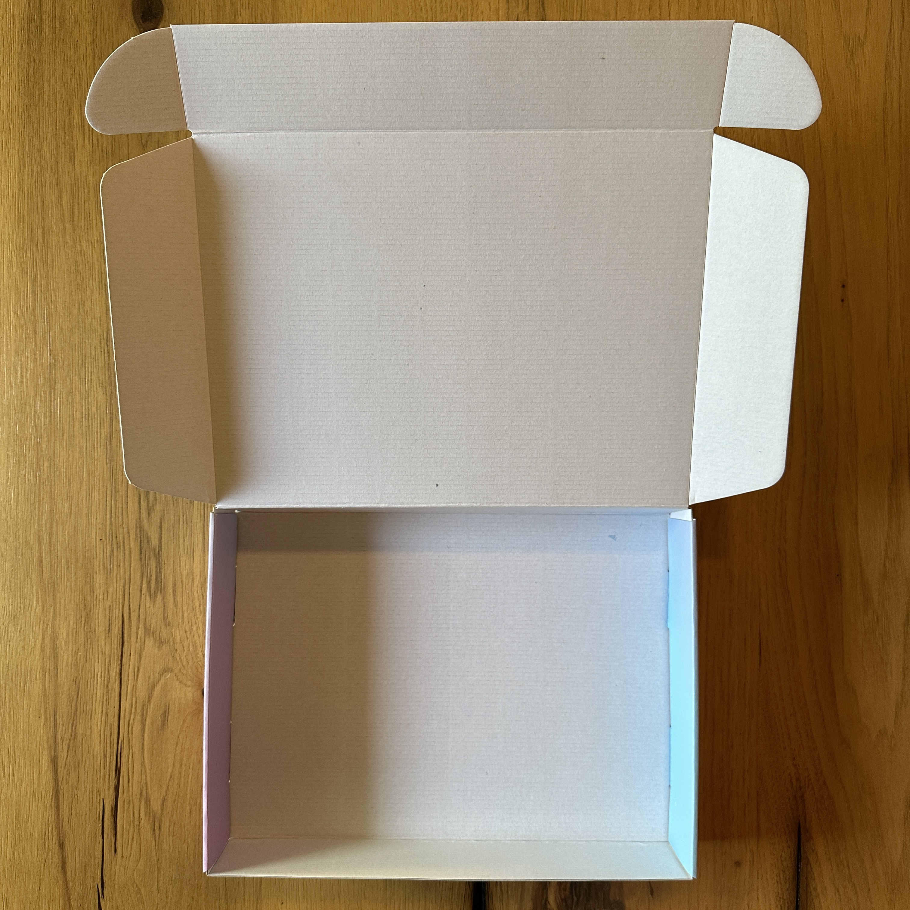

1. Connect the left shipping protector and right shipping protector together.
    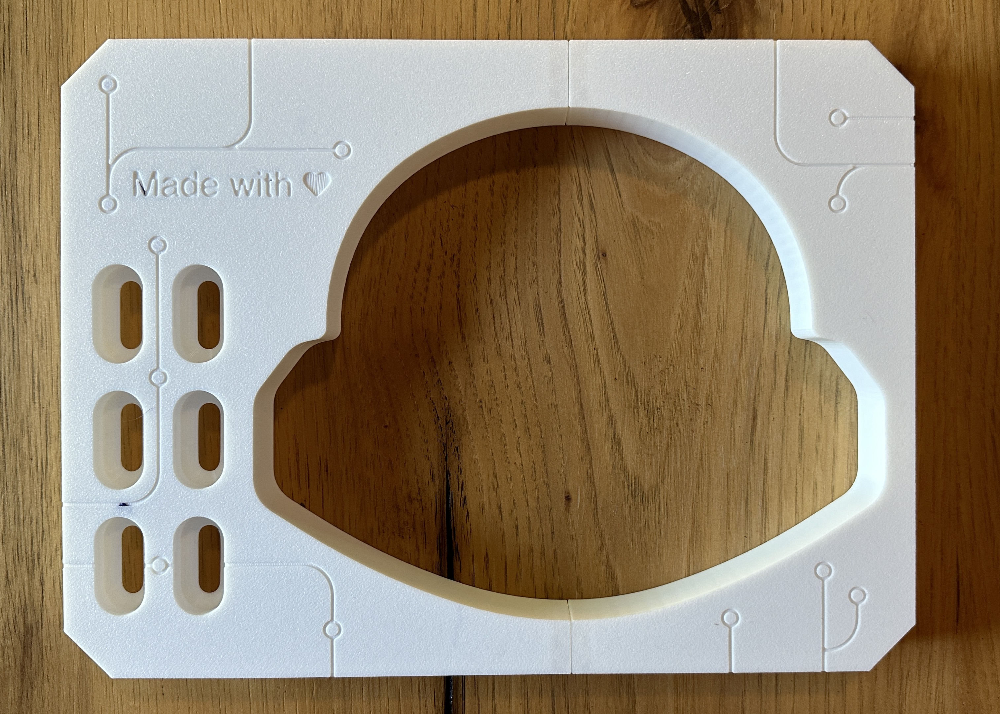

1. Insert the shipping connector into the box.
    > Note: It may appear loose. The gaps will be filled when the top is closed.
    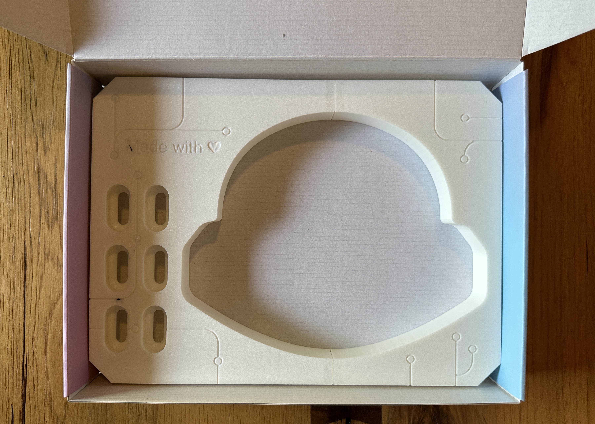

1. Insert the lamp.
    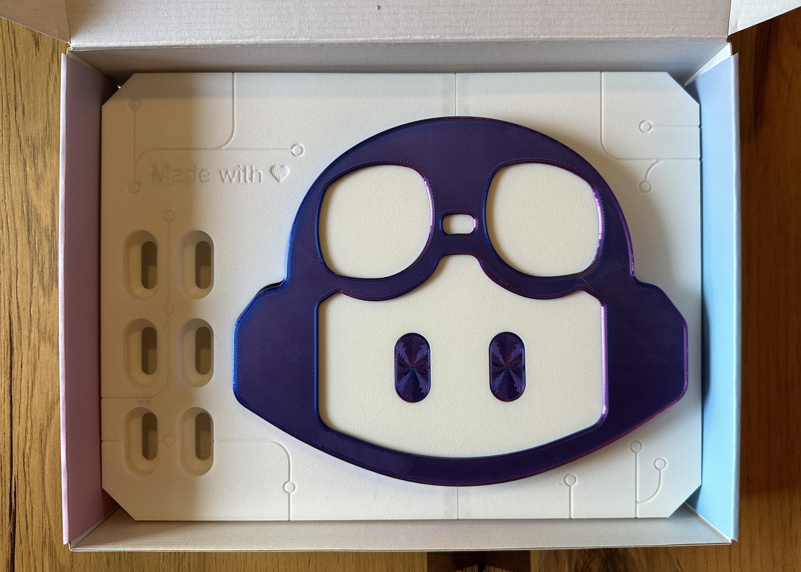

1. Pick some fun extra eye colors. Snap them into the holders.
    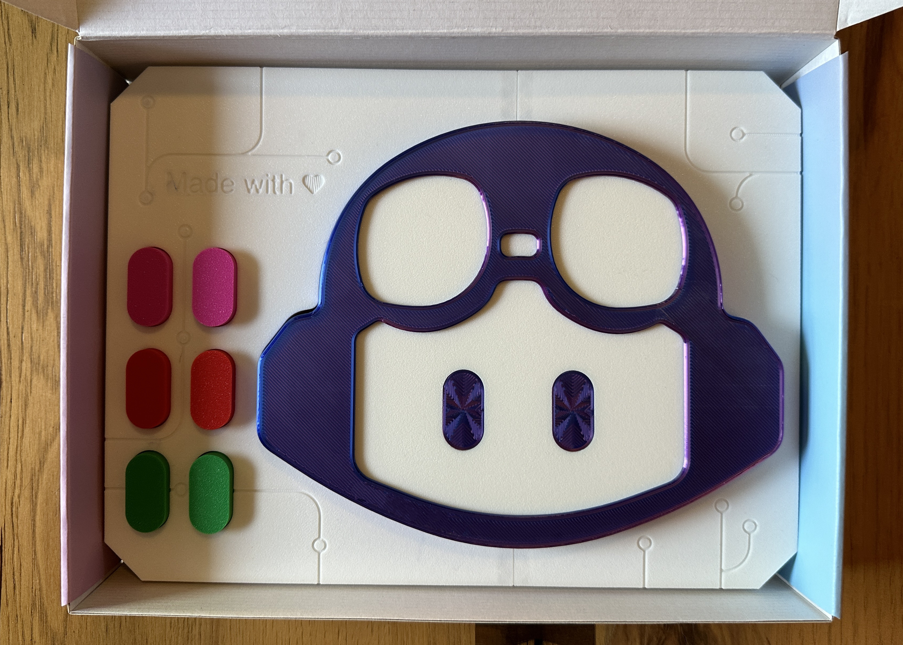

1. Add a sheet of protective foam.
    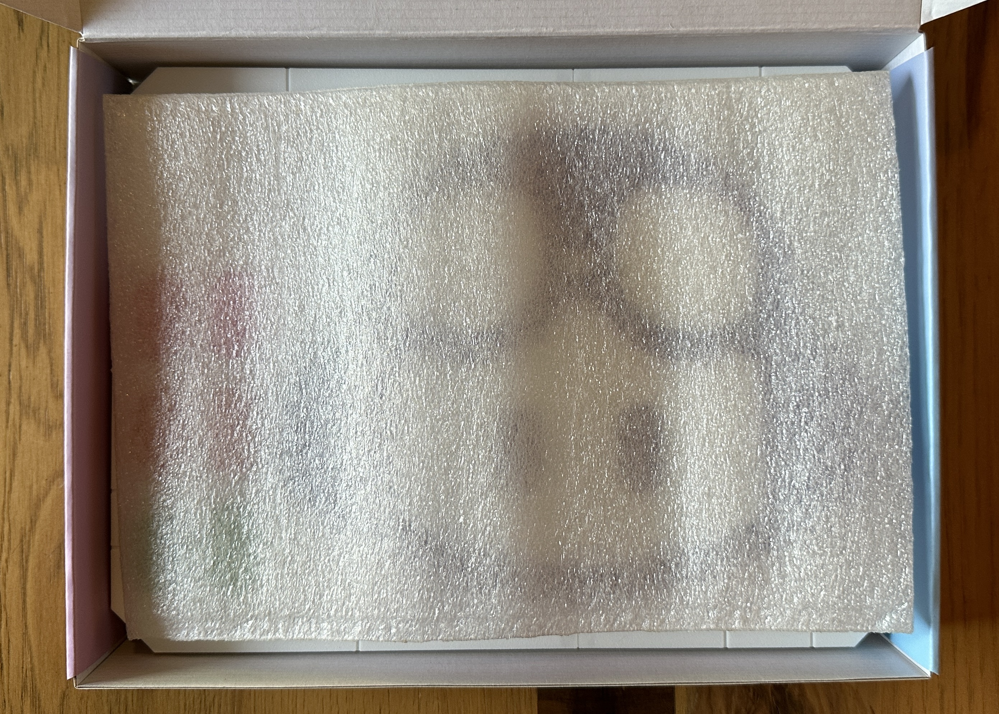

1. Add the QR Guide.
    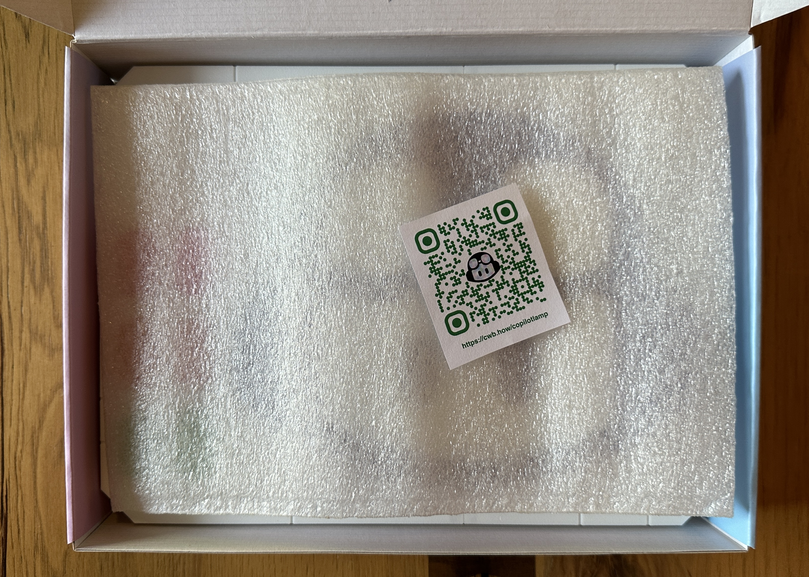

1. Close the box. Smile for a job well done! 🤓
    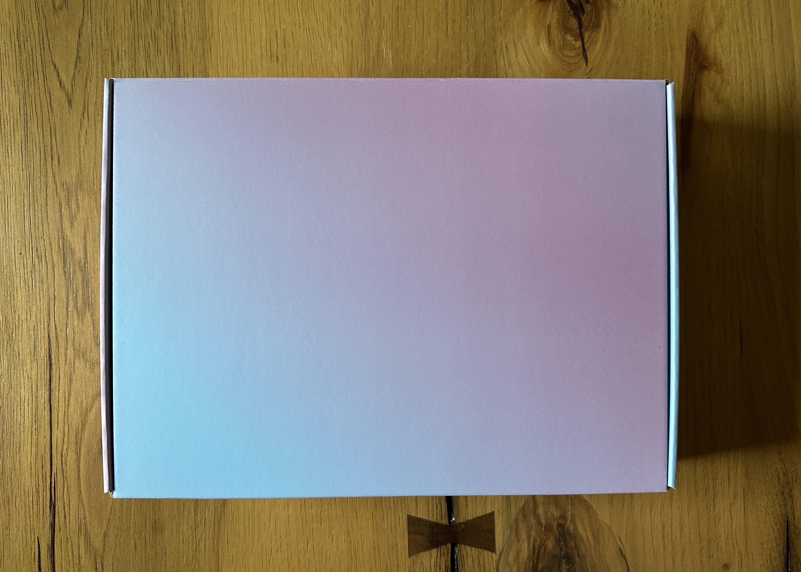

## 3. Ship the gift

1. Add some shipping protection.

1. Insert the completed gift.

1. Add some mor shipping protection.

1. Close it up and add an address.

1. Take it to the post office!
